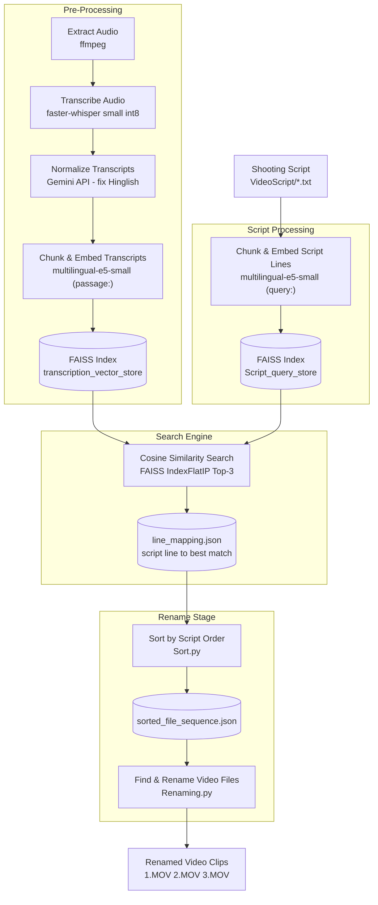

```mermaid
graph TD
  S["Shooting Script\nVideoScript/*.txt"] --> SP

  subgraph PREPROCESS["Pre-Processing"]
    B["Extract Audio\nffmpeg"] --> C["Transcribe Audio\nfaster-whisper small int8"]
    C --> D["Normalize Transcripts\nGemini API - fix Hinglish"]
    D --> E["Chunk & Embed Transcripts\nmultilingual-e5-small (passage:)"]
    E --> F[("FAISS Index\ntranscription_vector_store")]
  end

  subgraph SCRIPT["Script Processing"]
    SP["Chunk & Embed Script Lines\nmultilingual-e5-small (query:)"] --> SQ[("FAISS Index\nScript_query_store")]
  end

  subgraph SEARCH["Search Engine"]
    F --> SE["Cosine Similarity Search\nFAISS IndexFlatIP Top-3"]
    SQ --> SE
    SE --> LM[("line_mapping.json\nscript line to best match")]
  end

  subgraph RENAME["Rename Stage"]
    LM --> SO["Sort by Script Order\nSort.py"]
    SO --> SF[("sorted_file_sequence.json")]
    SF --> RN["Find & Rename Video Files\nRenaming.py"]
  end

  RN --> OUT["Renamed Video Clips\n1.MOV 2.MOV 3.MOV"]
```
